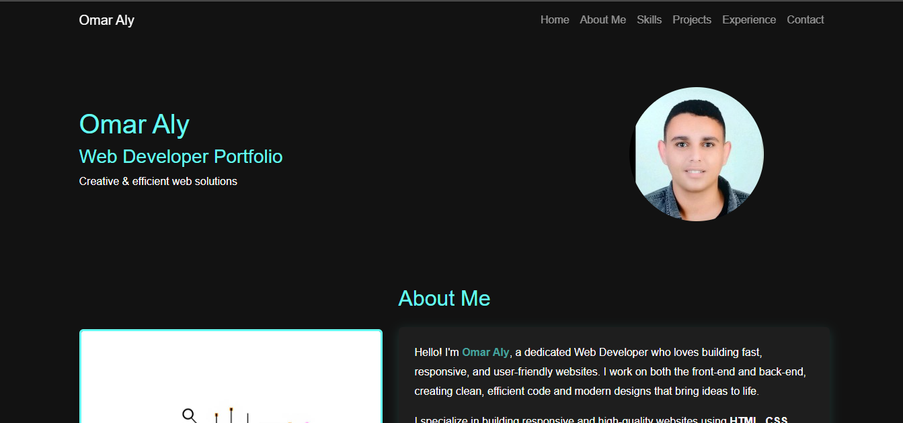

# Omar Aly - Web Developer Portfolio

 <!-- ضع صورة من المشروع هنا -->

## 📌 Overview
This is my personal **Web Developer Portfolio**, showcasing my skills, projects, and professional experience.  
The website is fully responsive and built using **HTML**, **CSS**, **JavaScript**, and **Bootstrap**.

🔗 **Live Demo:** [Click Here](https://omar-abdelrady63.github.io/Portfolio/) 

---

## ✨ Features
- **Responsive Design** – Works seamlessly across all devices.
- **Smooth Navigation** – Easy-to-use navbar with section-based scrolling.
- **Back to Top Button** – Quick navigation to the top of the page.
- **Portfolio Showcase** – Displays projects with links to demos and source code.
- **About Me Section** – Overview of my skills and experience.
- **Contact Section** – Multiple ways to connect (Email, LinkedIn, GitHub, WhatsApp).

---

## 🛠️ Technologies Used
- **HTML5** – Structure
- **CSS3** – Styling
- **Bootstrap 5** – Responsive framework
- **JavaScript** – Interactivity
---

## 📂 Sections
1. **Home** – Introduction and profile photo.
2. **About Me** – Detailed overview of my skills and development approach.
3. **Skills** – Technical and soft skills.
4. **Projects** – List of personal and training projects with links.
5. **Experience** – Education and internships timeline.
6. **Contact** – Email and social media links.

---

## 🚀 Projects in This Portfolio
| Project | Description | Live Demo | Source Code |
|---------|-------------|-----------|-------------|
| Restaurant Website | Modern restaurant landing page with HTML & CSS | [Demo](https://omar-abdelrady63.github.io/Restaurant/) | - |
| Feane Restaurant | Bootstrap-based responsive restaurant website | [Demo](https://omar-abdelrady63.github.io/Feane/) | - |
| Sliders | Different slider designs with HTML, CSS, JS | [Demo](https://omar-abdelrady63.github.io/Sliders/) | - |
| CRUD (Node.js) | CRUD operations app using Node.js & Express.js | - | [Code](https://github.com/omar-abdelrady63/CRUD-operations-using-node.js) |
| CRUD (Laravel) | Full-stack CRUD app using PHP Laravel | - | [Code](https://github.com/omar-abdelrady63/CRUD-Operations-using-PHP-laravel) |

---

## 📄 How to Run Locally
```bash
# Clone the repository
git clone https://github.com/omar-abdelrady63/portfolio.git

# Navigate into the folder
cd portfolio

# Open index.html in your browser
